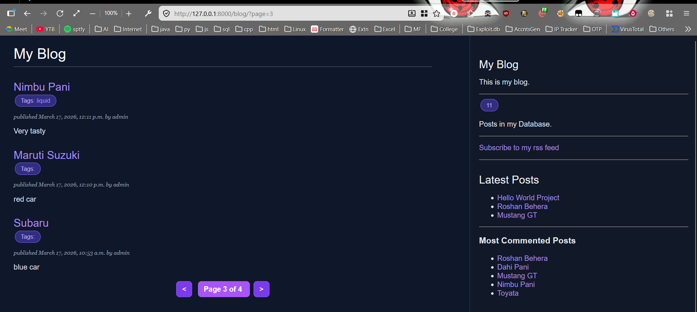
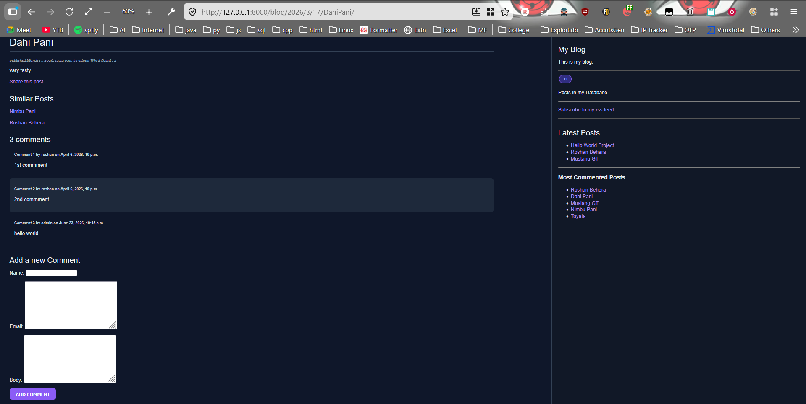

# Django Blog App

A Blog project that enables content publishing, reader engagement, and content discovery through comments, tags, search and sharing functionality. The application also includes SEO-focused features such as XML sitemaps and clean URL structures to improve content indexing and discoverability.
## Features

* Create and manage blog posts
* Tag-based content organization
* Comment system
* Share posts via email
* Search functionality
* Related post recommendations
* Pagination
* SEO-friendly URLs
* XML Sitemap generation
* Django Admin integration

---

## Screenshots

### Home Page



### Post Detail Page



---

## Tech Stack

* Python
* Django 5
* HTML
* CSS
* SQLite
* Docker

## Run Locally

```bash
git clone https://github.com/obitouka/Blog-Project.git
```

```bash
cd Blog-Project
```

```bash
pip install -r requirements.txt
```

```bash
python manage.py migrate
```

```bash
python manage.py runserver
```
